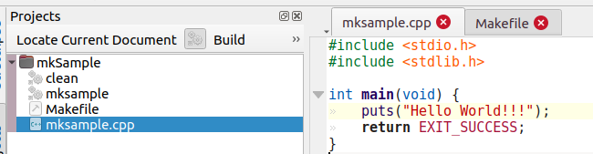

# IDE
集成开发环境本地使用的KDevelop

# KDevelop导入makefile项目

如果有个项目结构简单如下：

```shell
└── mkSample
    ├── Makefile
    └── mksample.cpp
```
用KDevelop可以很方便通过菜单栏Project-->Open/Import Project导入你需要的工程所在的目录（makefile所在的文件夹）入下图所示


选择Open后弹出如下对话框，并选择右下脚的Finish完成导入（图片没有截出Finish部分）


这个时候你就能看到完整的项目入下图所示：



在左边能看到clean和mksample两个目标，通过右键选择对应的目标-->build就可以运行相应的目标。

当然你也可以入下图所示直接点击[build]


如果需要Debug断点，需要首先检查Makefile文件生成的运行文件的编译参数是否有-g，如果没有是无法做调试的！！！

```
g++ -o mksample mksample.cpp -g
```

确认了有-g后，就可以在Run-->Config Launch里设置可运行的文件位置，有了这个才能断点调试。如下图所示


设置好后，可以在需要断点的程序行上右键-->Toggle Breakpoint,标记好后，那一行的背景色会发生变化，入下图：


这个时候就可以点击Debug按键开始做Debug了，如下图所示，代码会停在断点位置，你可以通过step over等进行代码调试（如果不想debug只看运行程雪，只需要使用Execute按键即可）

